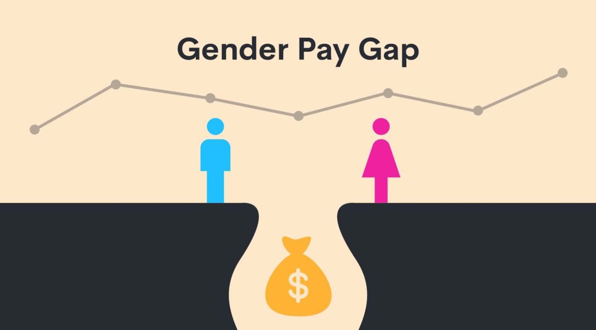

# Information Visualisation: the Gender Pay Gap

Jupyter Book visualising the gender pay gap for software developers,
using the Stack Overflow Annual Developer Survey data. For more details
regarding the datasets source and the cleaning process, see the
[Datasets](#datasets) section below.

# Table of Contents

- [Information Visualisation: the Gender Pay Gap](#information-visualisation-the-gender-pay-gap)
- [Table of Contents](#table-of-contents)
- [Getting started](#getting-started)
- [Usage](#usage)
- [Deploy](#deploy)
- [Datasets](#datasets)
  * [Cleaning process](#cleaning-process)
- [Authors](#authors)

# Getting started

```
git clone git@github.com:p-adema/info-vis.git
cd info-vis
pip3 install -r requirements.txt
```

Additionally, install `conda` to setup a local environment.
- [MacOS installation instructions](https://docs.conda.io/projects/conda/en/latest/user-guide/install/macos.html)
- [Windows installation instructions](https://docs.conda.io/projects/conda/en/latest/user-guide/install/windows.html)
- [Linux installation instructions](https://docs.conda.io/projects/conda/en/latest/user-guide/install/linux.html)

In case you don't have `juptyer` installed locally, simply run `pip3 install jupyter`.

# Usage

Run `jupyter notebook` inside the root of this repository. All notebooks that go
into the data story should be created inside the `notebooks` directory. In order
to keep a maintainable and flexible structure, create one notebook per plot.

The main data story notebook is `./notebooks/story.ipynb`. In between texts, you
can include the results from other plots, simply by adding a new code cell with
the following contents `%run example_plot.ipynb`. Only the result of the last
cell inside `example_plot.ipynb` will be rendered.

# Deploy

In order to deploy to GitHub pages, you can run the following command: `ghp-import -n -p -f _build/html`.
This will trigger a [GitHub Action](https://github.com/p-adema/info-vis/actions/workflows/pages/pages-build-deployment) that will deploy the project.

# Datasets

This project uses the 2014-2022 datasets listed at
[Stack Overflow Annual Developer Survey](https://insights.stackoverflow.com/survey).

## Cleaning process

The dataset cleaning task has been divided between Peter and Kim. Initially,
we weren't sure which years to include yet. Therefore, Kim did 2011-2016 and
Peter did 2017-2022. After some brainstorming, we have decided to choose Gender
Pay Gap as our topic. This resulted in the datasets from 2011, 2012 and 2013
being useless, because they did not contain the gender of each participant.

Every year contained column changes, including column renaming, structural
changes or new columns that have been added. Peter and Kim both have manually
merged these columns by inspecting them one by one and merge the ones that
overlap. Columns that were not of use were immediately excluded during this
process.

After merging columns, data had to be normalised for all years. This has been
done by simply checking the unique values for each column and combine values
with the same meaning.

After both Peter and Kim had successfully cleaned and normalised all columns,
both datasets from 2014-2016 and 2017-2022 have been merged together into a
single 2014-2022 dataset.

We have decided to use parquet `.pq` as the file type. This allows us to specify
the datatype for each column and decrease the overall file size of the final
dataset. Additional gzip compression has been applied. This resulted in a 7.2MB
parquet file, rather than a 145MB csv file.

# Authors
- Peter Adema
- Aize van Basten Batenburg
- Wim Berkelmans
- Kim Koomen
